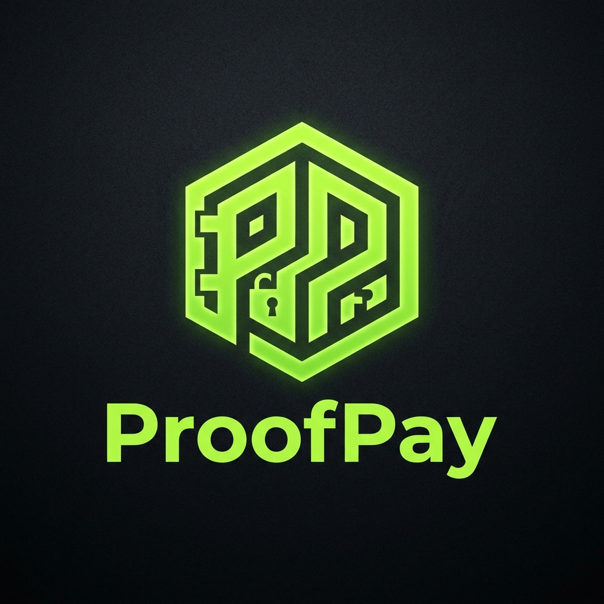

# ProofPay

<p align="center">
  
</p>

ProofPay is an escrow application for Celo MiniPay. It allows clients to lock funds in a smart contract and release them to service providers once a service is completed.

## Features
- Payments are held in the ProofPayEscrow contract rather than by a intermediary.
- A 7-day dispute period for clients to address any issues.
- Interface designed for mobile use with one-tap actions.
- Layout focused on clarity and security.

## Live on Celo Mainnet
- Escrow Contract: `0xc496A211dB0ef052663017aF2a3e14296F012faD`
- cUSD Token: `0x765DE816845861e75A25fCA122bb6898B8B1282a`

## Developer SDK (NPM)
The ProofPay SDK can be used to add escrow functionality to other platforms.

```bash
npm install @cryptoflops/proof-pay
```

### Usage
```typescript
import { useProofPay } from '@cryptoflops/proof-pay';

const { createEscrow, releaseEscrow } = useProofPay();
```

## Local Development & MiniPay Testing
1. Clone the repository.
2. Run `npm install`
3. Run `npm run dev`

### Testing in MiniPay (Developer Mode)
To test this application natively inside the Opera MiniPay wallet:
1. Expose your local dev server using ngrok: `ngrok http 3000`
2. Open Opera Mini on your Android device and navigate to MiniPay.
3. Tap the settings icon and enable "Developer Mode".
4. Enter your `ngrok` URL in the test app input field.
5. The application will implicitly auto-connect to the MiniPay injected provider without showing the "Connect Wallet" CTA.

## Proof-of-Ship Analytics
This repository implements on-chain metrics and user event tracking (mocked via `src/utils/analytics.ts` for this submission scope) to fulfill the Celo Proof-of-Ship requirements. Logged events include `escrow_created` and `escrow_link_copied`.

## License
MIT
