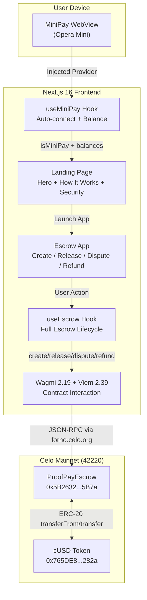
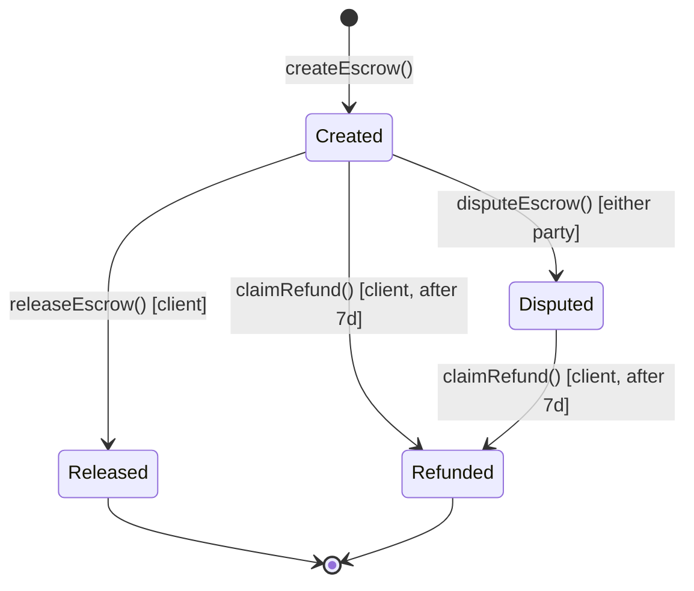

# ProofPay Architecture

## System Overview

## Component Architecture

| Layer | Component | Purpose |
|-------|-----------|---------|
| **Entry** | `app/layout.tsx` | Root layout, header with "Launch App" CTA, footer with verified contract link |
| **Provider** | `ClientWrapper` > `ContextProvider` | WagmiProvider, QueryClient, AppKit, NetworkEnforcer, MiniPayBar |
| **Pages** | `app/page.tsx` | Landing page with hero, how-it-works, security sections |
| | `app/app/page.tsx` | Escrow management app |
| **Hooks** | `useMiniPay` | MiniPay detection, auto-connect, chain forcing, stablecoin balances |
| | `useEscrow` | Create, release, dispute, refund escrows + read escrow details |
| **Contract** | `ProofPayEscrow.sol` | Solidity 0.8.19, cUSD escrow with dispute + timeout refund |

## Tech Stack

| Category | Technology | Version |
|----------|-----------|---------|
| Framework | Next.js (App Router) | 16.2.3 |
| UI | React | 19.2.0 |
| Styling | Tailwind CSS | 3.4.18 |
| Web3 | Wagmi | 2.19.4 |
| Web3 | Viem | 2.39.2 |
| Wallet | Reown AppKit | 1.8.14 |
| Icons | Lucide React | 1.16.0 |
| Deploy | Cloudflare Pages | via OpenNext |

## Smart Contract

**ProofPayEscrow** (Solidity 0.8.19)
- `createEscrow(address freelancer, uint256 amount)` -- client locks cUSD in escrow
- `releaseEscrow(uint256 escrowId)` -- client releases funds to freelancer
- `disputeEscrow(uint256 escrowId)` -- either party flags a dispute
- `claimRefund(uint256 escrowId)` -- client reclaims after 7-day timeout
- `escrows(uint256)` -- returns full escrow struct
- Events: `EscrowCreated`, `EscrowReleased`, `EscrowDisputed`, `EscrowRefunded`

## Escrow Lifecycle

